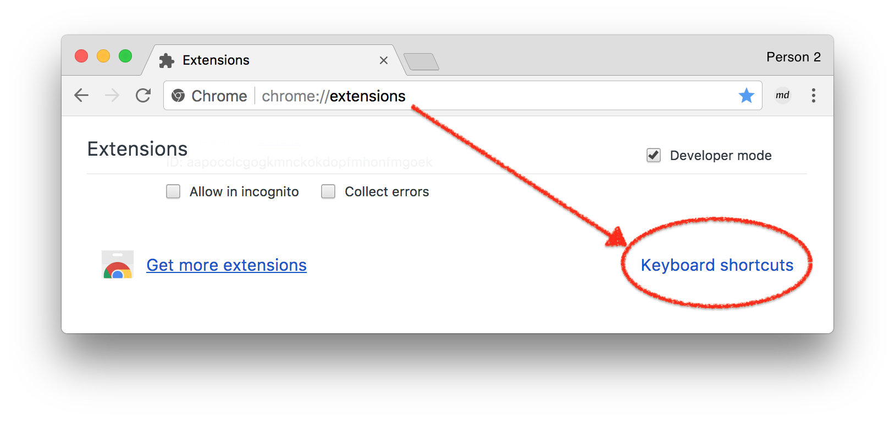
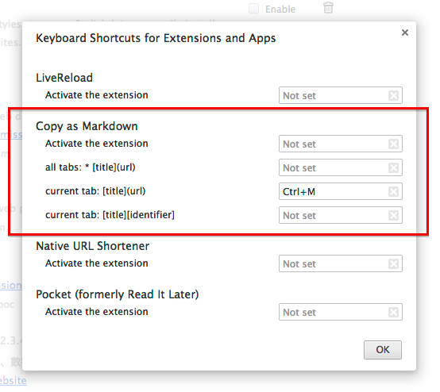

# Copy as Markdown for Chrome & Firefox

Do you often type Markdown code manually for a link or image, or even all tabs in a window, and feel tired? **Copy as Markdown** can help you!

## Download

* Google Chrome: [Chrome Web Store - Copy as Markdown](https://chrome.google.com/webstore/detail/copy-as-markdown/fkeaekngjflipcockcnpobkpbbfbhmdn?hl=en)
* Firefox: [Copy as Markdown :: Add-ons for Firefox](https://addons.mozilla.org/en-us/firefox/addon/copy-as-markdown/)

## Features

**Copy as Markdown** is a browser extension helps you copy the following things as Markdown to your system clipboard:

:ballot_box_with_check: Current Tab as Link<br>
:ballot_box_with_check: A Link in the Page<br>
:ballot_box_with_check: An Image in the Page<br>
:ballot_box_with_check: An Image that is wrapped with a Link<br>
:ballot_box_with_check: All Tabs as a List of Links<br>
:ballot_box_with_check: Highlighted Tabs as a List of Links

## Keyboard Shortcuts (Chrome-only)

You can add keyboard shortuts for copying tab(s) as Markdown. By default, Copy as Markdown does not assign any keyboard shortcuts.

1. Open Extensions Page at chrome://extensions/.
2. Scroll to the bottom and click "Keyboard shortcuts"

3. Assign Keyboard Shortcuts in the dialog.



## Known Issues

* [Chrome] When copying an image, the image code does not include the alternative text of that image. This is due to API restriction.

## Development

### Install dependencies

```
yarn install
```

### Build for Development

```
yarn build
```

* Chrome Version: `build/chrome/`
* Firefox Version: `build/firefox/`

To debug in Chrome: [Window] Menu -> Extensions -> Load unpacked extension

To debug in Firefox: [Tools] Menu -> Add-ons -> [Gear] Icon -> Debug Add-ons -> Load Temporary Add-on

TODO: Unit Tests

## License

See [MIT-LICENSE.txt](./MIT-LICENSE.txt)
